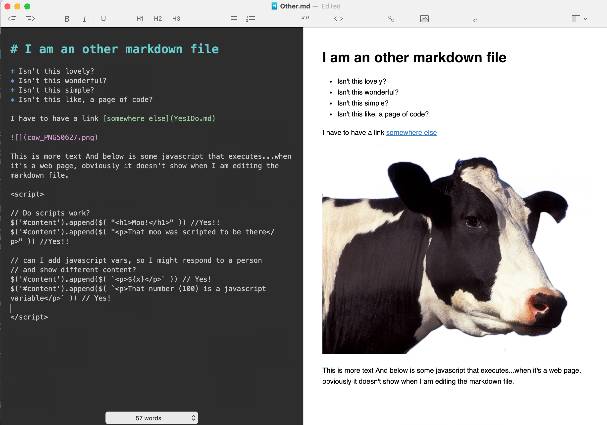

# I am an other markdown file

* Isn't this lovely?
* Isn't this wonderful?
* Isn't this simple?
* Isn't this like, a page of code?

I have to have a link [somewhere else](YesIDo.md)

This is more text And below is some javascript that executes...when it's a web page, obviously it doesn't show when I am editing the markdown file.

This is what editing this page looks like.

